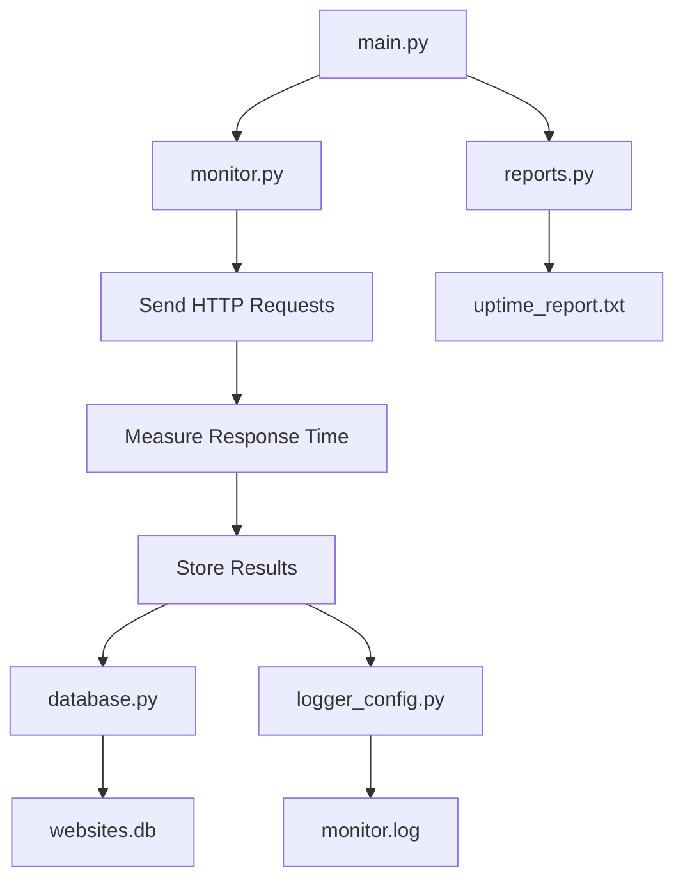

# Website Monitor

> A lightweight, modular Python tool for monitoring website availability, measuring response times, logging activity, persisting results in SQLite, and generating uptime reports.

---

## Table of Contents

- [Features](#features)
- [Folder Structure](#folder-structure)
- [System Flow](#system-flow)
- [Module Overview](#module-overview)
- [Requirements](#requirements)
- [Installation & Usage](#installation--usage)
- [Output Files](#output-files)
- [Roadmap](#roadmap)
- [License](#license)

---

## Features

- Monitor multiple websites concurrently
- Measure HTTP response time and status codes
- Persist results in a local SQLite database
- Structured activity logging
- Generate human-readable uptime reports
- Modular architecture — easy to extend

---

## Folder Structure

Here’s a **copy-paste ready `README.md`** with a clear **folder structure** and **Mermaid system flow diagram**.

---

# 🌐 Website Monitor (Python)

A lightweight Python-based website monitoring tool that checks website availability, measures response time, logs activity, stores results in a local SQLite database, and generates uptime reports.

---

## 📁 Folder Structure
>>>>>>> 85f85e3 (implemented the Flask and done with the UI)

```
website-monitor/
│

├── main.py               # Entry point
├── monitor.py            # Core monitoring logic
├── database.py           # SQLite database operations
├── logger_config.py      # Logging configuration
├── reports.py            # Uptime report generation
│
├── websites.db           # Generated: monitoring data
├── monitor.log           # Generated: activity log
└── uptime_report.txt     # Generated: uptime summary
├── main.py
├── monitor.py
├── database.py
├── logger_config.py
├── reports.py
│
├── websites.db
├── monitor.log
└── uptime_report.txt
```

---

<<<<<<< HEAD
## System Flow
=======
## 🔁 System Flow Diagram (Mermaid)
>>>>>>> 85f85e3 (implemented the Flask and done with the UI)


<<<<<<< HEAD

---

## How It Works

1. **`main.py`** initializes and orchestrates the monitoring cycle.
2. **`monitor.py`** dispatches HTTP requests to all configured target websites.
3. Response time and HTTP status are captured and evaluated.
4. **`database.py`** persists the results into `websites.db` (SQLite).
5. **`logger_config.py`** writes structured activity entries to `monitor.log`.
6. **`reports.py`** reads the database and produces a summary in `uptime_report.txt`.

---

## Module Overview

| Module             | Responsibility                          |
|--------------------|-----------------------------------------|
| `main.py`          | Application entry point and orchestration |
| `monitor.py`       | HTTP request handling and status checks |
| `database.py`      | SQLite schema, reads, and writes        |
| `logger_config.py` | Centralized logging setup               |
| `reports.py`       | Uptime report generation from DB data   |

---

## Requirements

- Python **3.8** or higher
- [`requests`](https://pypi.org/project/requests/) library

---


## Output Files

| File                | Description                              |
|---------------------|------------------------------------------|
| `websites.db`       | SQLite database storing all check results |
| `monitor.log`       | Timestamped log of monitoring activity   |
| `uptime_report.txt` | Human-readable uptime summary report     |

---

## Roadmap

- [ ] Email / SMS alerts on downtime detection
- [ ] External config file for managing target websites
- [ ] Web-based dashboard for real-time visualization
- [ ] CSV and JSON export support
- [ ] Scheduled monitoring via cron or APScheduler

---


=======

---

## 🚀 Features

* Monitor multiple websites
* Measure response time and status
* Log monitoring activity
* Store results in SQLite database
* Generate uptime reports
* Modular and easy to extend

---

## ⚙️ How It Works

1. `main.py` starts the monitoring process.
2. `monitor.py` sends HTTP requests to websites.
3. Response time and status are calculated.
4. Results are saved via `database.py` into `websites.db`.
5. Logging is handled by `logger_config.py` into `monitor.log`.
6. `reports.py` reads the database and creates `uptime_report.txt`.

---

## 🧩 Module Description

| File               | Description                |
| ------------------ | -------------------------- |
| `main.py`          | Entry point of the project |
| `monitor.py`       | Core monitoring logic      |
| `database.py`      | SQLite database operations |
| `logger_config.py` | Logging configuration      |
| `reports.py`       | Generates uptime reports   |

---

## 🛠️ Requirements

* Python 3.8+
* Install dependency:

```bash
pip install requests
```

---

## ▶️ Run the Project

```bash
python main.py
```

---

## 📊 Output Files

| File                | Purpose                   |
| ------------------- | ------------------------- |
| `websites.db`       | Stores monitoring results |
| `monitor.log`       | Logs system activity      |
| `uptime_report.txt` | Uptime summary report     |

---

## ✨ Future Improvements

* Email/SMS alerts for downtime
* Config file for websites
* Web dashboard
* CSV/JSON export
* Task scheduling (cron)

---

## 📜 License

Free to use for educational and personal projects.

---

**Author:** Your Name
    
>>>>>>> 85f85e3 (implemented the Flask and done with the UI)
